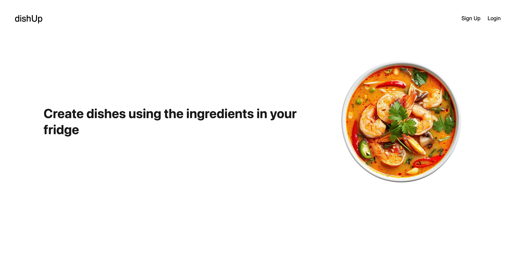

# **DishUp** 🍽️ 

### **Description**
DishUp is a recipe discovery app designed to help users create delicious meals with ingredients they already have. Inspired by the challenge of cooking creatively while minimizing food waste, DishUp provides recipe ideas tailored to each user’s available ingredients. It’s the perfect tool for home cooks looking to maximize their resources and discover new recipes without needing to make a special trip to the store.

---

## **Motivation**
DishUp was built to address the common problem of “What can I make with what’s in my fridge?” Our team saw a need for an app that not only offers recipes but also provides them in a **personalized** way, making it easier to cook creatively, avoid food waste, and save money. This project also provided an excellent opportunity to learn and integrate full-stack development skills into a meaningful and user-friendly application.

---

## **Why We Built DishUp**
Our mission was to:
- **Promote mindful cooking** by using ingredients on hand, which helps reduce food waste.
- **Encourage culinary exploration** by helping users discover recipes they might not have tried otherwise.
- **Develop a user-friendly platform** that leverages external recipe APIs and a virtual fridge concept to deliver unique, ingredient-based suggestions.

---

## **How It Works**
DishUp features an interactive experience where users can:
1. **Sign up** or **log in** to access the personalized recipe features.
2. **Enter ingredients** they have on hand.
3. **Discover recipes** matched to their ingredients, with options to save, cook, and share.
4. **Explore and manage recipes** they love, helping them try new dishes and optimize their grocery shopping.

---

## **What We Learned**
Building DishUp taught us valuable lessons in:
- **API Integration**: We developed skills to retrieve and handle data from multiple APIs, combining it with user inputs for seamless results.
- **User Experience Design**: Crafting an intuitive UI that keeps the user engaged while focusing on simplicity and functionality.
- **Full-Stack Development**: We enhanced our skills in database management with PostgreSQL, authentication with JWT, and front-end development with React.

---

## **What Makes DishUp Stand Out**
DishUp stands out due to its focus on **personalized recipe suggestions**, made possible by leveraging user-provided ingredients. Unlike generic recipe apps, DishUp prioritizes making cooking both **accessible and resourceful**, encouraging users to create something new and exciting with what they already have.

---

## **Technologies Used**

- **Front End**: React, CSS, HTML
- **Back End**: Node.js, Express.js
- **Database**: PostgreSQL, Sequelize ORM
- **Authentication**: JSON Web Token (JWT)
- **APIs**: Recipe API integrations
- **Deployment**: Render

---

## **Screenshot**

---

## **Deployed Application**

Check out DishUp live: [DishUp](https://recipemaker-xwnr.onrender.com/)

---
## **Contributors**

- [Anthonymoon2](https://github.com/anthonymoon2)
- [Balshersran](https://github.com/balshersran)
- [MassiEscalante](https://github.com/MassiEscalante)
- [Yohana909](https://github.com/yohana909)
