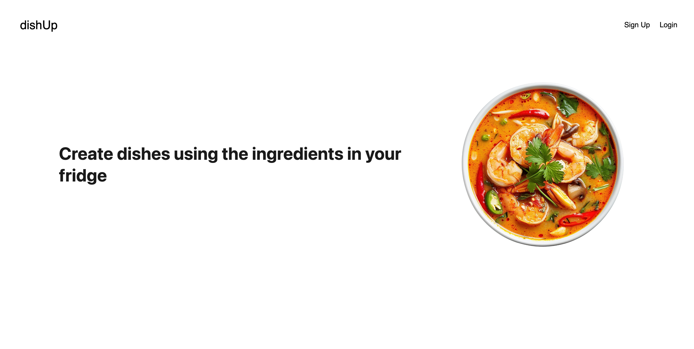

# **DishUp** 🍽️ 

### **Description**
DishUp is a full stack recipe discovery website designed to help deliver recipes based off the ingredients you already have at home.

## **Technologies Used**

- **Front End**: React, CSS, HTML
- **Back End**: Node.js, Express.js
- **Database**: PostgreSQL, Sequelize ORM
- **Authentication**: JSON Web Token (JWT)
- **APIs**: Recipe API integrations
- **Deployment**: Render

---

## **Screenshot**

---

## **Deployed Application**

Check out DishUp live: [DishUp](https://recipemaker-xwnr.onrender.com/)

---
## **Contributors**

- [Anthonymoon2](https://github.com/anthonymoon2)
- [Balshersran](https://github.com/balshersran)
- [MassiEscalante](https://github.com/MassiEscalante)
- [Yohana909](https://github.com/yohana909)
